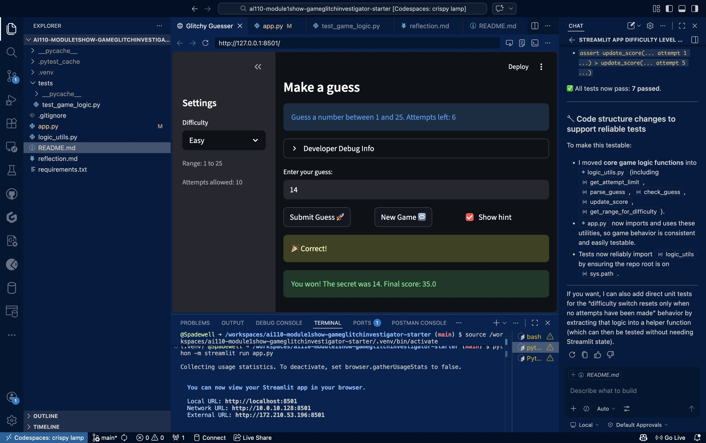

# 🎮 Game Glitch Investigator: The Impossible Guesser

## 🚨 The Situation

You asked an AI to build a simple "Number Guessing Game" using Streamlit.
It wrote the code, ran away, and now the game is unplayable. 

- You can't win.
- The hints lie to you.
- The secret number seems to have commitment issues.

## 🛠️ Setup

1. Install dependencies: `pip install -r requirements.txt`
2. Run the broken app: `python -m streamlit run app.py`

## 🕵️‍♂️ Your Mission

1. **Play the game.** Open the "Developer Debug Info" tab in the app to see the secret number. Try to win.
2. **Find the State Bug.** Why does the secret number change every time you click "Submit"? Ask ChatGPT: *"How do I keep a variable from resetting in Streamlit when I click a button?"*
3. **Fix the Logic.** The hints ("Higher/Lower") are wrong. Fix them.
4. **Refactor & Test.** - Move the logic into `logic_utils.py`.
   - Run `pytest` in your terminal.
   - Keep fixing until all tests pass!

## 📝 Document Your Experience

- [ ] Describe the game's purpose.
:- The game's purpose was to find and fix the bugs in place, using suggestions from AI tools like Copilot Agent, ChatGPT, etc.

- [ ] Detail which bugs you found.
"""
:- The difficulties are also buggy as the number of attempts aren't consistent with the difficulty level, For example; Easy was 5, Normal was 7 and Hard was 4.

:- The game accepted inputs outside the described limits, and the "Range/Attempts allowed description" under the difficulty bar don't match the actual guesses and allowed attempts left.

:- Attempts were counting down incorrectly as when a user had 1 attempt left out of 10 for example, it showed the "Out of attempts" message.

"""

- [ ] Explain what fixes you applied.
"""
:- Modified the attempt_limit_map variable to correctly represent the attempt limits for each difficulty level

:- Modified the check_guess function to also display the correct error message in the case the user inputs an out-of-bounds guess

:- Attempts were counting down incorrectly in the UI because somewhere in app.py, we had `if st.session_state.attempts >= attempt_limit:` when instead, it should have been `if st.session_state.attempts > attempt_limit:`, with the difference being the `>` symbol
"""

## 📸 Demo

- [ ] [Insert a screenshot of your fixed, winning game here]
"""

"""

## 🚀 Stretch Features

- [ ] [If you choose to complete Challenge 4, insert a screenshot of your Enhanced Game UI here]
